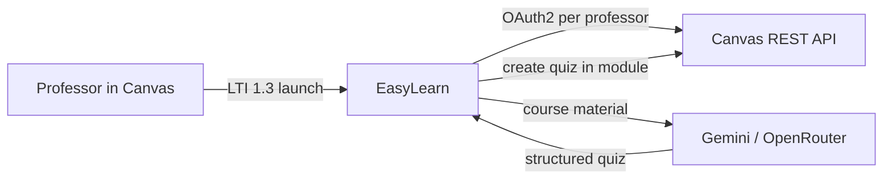

# EasyLearn

EasyLearn is an LTI 1.3 compliant web application and suite of CLI tools designed to
generate structured quizzes from Canvas course materials (PDF/PPTX) using configurable
AI models (Google Gemini and OpenRouter), and deploy them directly back to Canvas
courses.

The project features a FastAPI-based dashboard and integration with Canvas using the
LTI 1.3 Advantage protocol. Each professor launches from their course, authorizes
with their own Canvas account, and works within their permissions.

---

## Quickstart

### Running locally

#### 1. Prerequisites

- Python >= 3.14
- [`uv`](https://docs.astral.sh/uv/) package manager (used for the app and all `utils/` scripts)
- `openssl` (for generating LTI RSA keys)
- A Canvas instance you administer (see [docs/canvas-setup.md](./docs/canvas-setup.md))

#### 2. Install dependencies

Initialize the virtual environment and install packages from [pyproject.toml](./pyproject.toml):

```bash
uv sync
```

#### 3. Configure

Copy the example files and fill in your values:

```bash
cp .env.example .env
cp config/lti_config.example.json config/lti_config.json
```

Minimal `.env` variables:

| Variable | Purpose |
|----------|---------|
| `CANVAS_API_URL` / `CANVAS_PUBLIC_URL` | Canvas API and browser URLs |
| `EASYLEARN_PUBLIC_URL` | This app's public URL (e.g. `http://localhost:8000` locally) |
| `CANVAS_API_TOKEN` | Admin token — **CLI utilities only** (`utils/configure_*.py`, `check_setup.py`) |
| `CANVAS_CLIENT_ID` / `CANVAS_CLIENT_SECRET` | OAuth API key (per-professor Canvas access) |
| `GEMINI_API_KEY` | Quiz generation (at least one AI provider required) |
| `SESSION_SECRET_KEY` | Cookie encryption |

Automate OAuth key creation after `.env` has `CANVAS_API_URL` and `CANVAS_API_TOKEN`:

```bash
uv run utils/configure_oauth.py --write-env
uv run utils/configure_lti.py
```

Full Canvas setup (Developer Keys, course content, LTI install): [docs/canvas-setup.md](./docs/canvas-setup.md).

#### 4. Generate RSA keypair

Canvas LTI 1.3 requires an RSA keypair in `keys/`:

```bash
mkdir -p keys
openssl genrsa -out keys/private.key 2048
openssl rsa -pubout -in keys/private.key -out keys/public.key
```

#### 5. Configure LTI tool JSON

Edit [config/lti_config.json](./config/lti_config.json) with the LTI Developer Key
**client id** and **deployment id** from Canvas. Match the issuer block to your
Canvas hostname (see [config/lti_config.example.json](./config/lti_config.example.json)).

#### 6. Verify

Run the setup doctor before your first launch to verify a correct setup:

```bash
uv run utils/check_setup.py
```

#### 7. Run

```bash
uv run main.py
```

The server binds to `http://0.0.0.0:8000`. Launch EasyLearn from a Canvas course
as a **teacher** to authorize and open the dashboard.

---

## How it fits together



Canvas uses **two Developer Keys**: LTI (launch identity) and OAuth (per-professor API
access). Details: [docs/lti-and-oauth.md](./docs/lti-and-oauth.md).

---

## Documentation

| Doc | Contents |
|-----|----------|
| [docs/canvas-setup.md](./docs/canvas-setup.md) | Canvas instance, Developer Keys, LTI config |
| [docs/lti-and-oauth.md](./docs/lti-and-oauth.md) | Launch flow, cookies, token refresh |
| [docs/cli.md](./docs/cli.md) | `utils/` command reference |
| [docs/architecture.md](./docs/architecture.md) | Code map and request lifecycle |
| [docs/demo.md](./docs/demo.md) | End-to-end demo runbook |
| [docs/testing.md](./docs/testing.md) | Manual test checklist |
| [docs/deployment.md](./docs/deployment.md) | Docker, Cloudflare Tunnel, production checklist |

---

## Docker deployment

For production or a containerized host, EasyLearn ships a Docker image. You still use
`uv` on the host to run setup utilities (`configure_oauth.py`, `configure_lti.py`,
`check_setup.py`) before starting the stack.

```bash
uv sync
cp .env.example .env
# configure .env, keys/, and config/lti_config.json — same as local quickstart above
uv run utils/configure_oauth.py --write-env
uv run utils/configure_lti.py

docker compose up -d --build
```

Optional Cloudflare Tunnel (set `TUNNEL_TOKEN` in `.env`):

```bash
docker compose --profile tunnel up -d --build
```

See [docs/deployment.md](./docs/deployment.md) for topology, environment variables,
and a production checklist.

---

## License

See repository license file.
